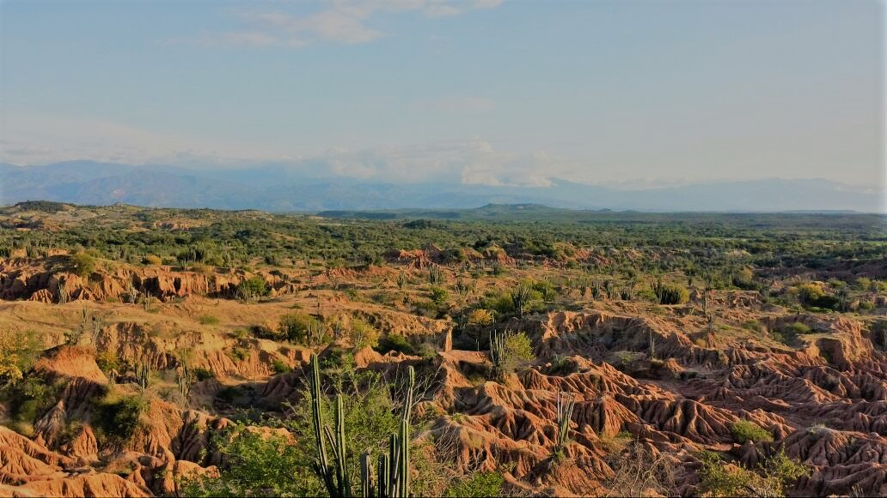

###Holaa.. ¡Bienvenidos!

Soy Karen Rivera, nací en Medellín-Colombia y soy estudiante de la Universidad Nacional
de Colombia. Me gusta viajar,leer,compartir, conocer nuevas culturas. Disfruto de comer, de mi familia y de mis amigos, soy una persona que hace todo lo que pueda por ayudar a las personas aunque tenga un caracter fuerte, soy sincera, tímida y amable.

Me identifico con esta frase: _**".. Tenemos que pensar lo que se llama pensar, es decir sentir.." (Cortázar,J.ed.,(1963).93.In:Rayuela. Madrid, p.545)**_

